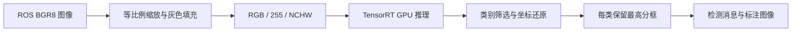

# YOLOv8 TensorRT ROS

面向 NVIDIA Jetson 的 YOLOv8 C++ 推理与 ROS1 图像检测项目。使用 TensorRT 执行 GPU 推理，输出检测框、类别和标注图像，支持动态参数与模型重载。提供色环和物料两套模型(当然，你可以使用自己的项目需求准备模型)、匹配的 ONNX、独立视觉启动配置，以及无需相机的图片测试程序。

**复现范围：从现有 ONNX 重建 TensorRT engine，编译并运行 ROS 检测链路。原部署模型对应的 PT、训练数据和完整训练记录未提供，不能从零复现原模型训练。**

## 项目结构

```text
source/ros_ws/src/bot_vision/
  src/yolo_trt_node.cpp         ROS 订阅、模型加载与结果发布
  src/usb_cam_node.cpp          V4L2 相机读取
  include/bot_vision/yolov8.hpp  TensorRT、预处理、推理和后处理
  include/bot_vision/common.hpp 检测结构、日志与 CUDA 检查
  engine_models/               已部署的 engine
  msg/                         Detection / DetectionArray
  cfg/                         动态参数
source/yolo_test/YOLOv8-TensorRT/
  yolo/                        与 C++ 节点匹配的 ONNX
  940.jpg                      图片测试输入
repro/
  vision_only.launch           独立视觉启动
  smoke_ros.py                 无相机 ROS 管线测试
config/                        历史设备及启动配置
docs/                          环境、模型、实现和验证说明
```

视觉部署只需要 `bot_vision`、匹配模型和 `repro/`。`source/yolo_test/` 还包含历史转换实验。公开仓库不包含整机的其他 ROS 包；不要直接运行历史整机 `yolo.launch`，它还引用串口、机械臂等节点。

## 工作原理



### 图像预处理

通过 `cv_bridge` 获取 BGR8 图像，固定使用 320×320 网络输入。原图宽高为 `W、H` 时，缩放比例为 `r=min(320/W,320/H)`；缩放尺寸取整后，以像素值 114 填充到正方形，避免直接拉伸改变目标比例。

代码用 CPU/OpenCV 完成缩放、填充及通道处理，将 BGR 排列为 RGB，除以 255，并组织为 float32 NCHW 张量 `[1,3,320,320]`。

### TensorRT 推理

ONNX 描述网络与权重，TensorRT 在目标 GPU 上选择执行策略并生成 engine。节点反序列化 engine，创建 execution context，分配 GPU/主机缓冲区，通过 CUDA stream 上传输入并调用 `enqueueV2()`；输出异步复制回主机并同步后，再进入 CPU 后处理。

engine 依赖 GPU、TensorRT 和构建环境，不是通用跨平台模型。更换设备或 TensorRT 版本后，应从 ONNX 重建。`--fp16` 允许内部计算使用 FP16，当前输入/输出接口仍为 FP32。

图像上的 FPS 只计 `infer()` 段，不包含完整 ROS、预处理、后处理和显示耗时，不能当作端到端帧率。

### 检测解码

当前节点要求单输出 `[1,4+nc,2100]`，其中 `nc` 是类别数。每个候选框包含 `cx、cy、w、h` 和类别分数，代码选择最高类别分数，没有单独的 objectness 乘法。

将中心坐标转换为框边界，保留分数**大于** `conf_thresh` 的候选框，然后撤销填充与缩放：例如 `x_original=(x_network-padding_x)/r`，并裁剪到原图范围。检测消息的 `x/y` 为左上角像素坐标，`w/h` 为像素宽高。

**当前后处理没有执行常规 IoU NMS，而是每个类别只保留最高分的一个框。** 色环最多输出 3 个框，物料最多输出 4 个框；同类多目标场景需要修改后处理。文件名中的 `nms` 不代表模型内置 NMS，应以真实输出结构为准。

## 模型与数据格式

| 模型 | 类别顺序 | 输入 | 输出 |
| --- | --- | --- | --- |
| 色环 | `red_ring,green_ring,blue_ring` | FP32 `[1,3,320,320]` | FP32 `[1,7,2100]` |
| 物料 | `red_wuliao,green_wuliao,blue_wuliao,purple` | FP32 `[1,3,320,320]` | FP32 `[1,8,2100]` |

匹配 ONNX：

```text
source/yolo_test/YOLOv8-TensorRT/yolo/ring_320_v8_nms_simp.onnx
source/yolo_test/YOLOv8-TensorRT/yolo/wuliao_320_v8_nms_simp.onnx
```

已部署 engine 位于 `source/ros_ws/src/bot_vision/engine_models/`，分别为 `ring_320_v8_nms_simp_static.engine` 和 `wuliao_320_v8_nms_simp_static.engine`。

不要替换为 `[1,300,6]` 的内置 NMS 模型、`num_dets/bboxes/scores/labels` 四输出模型或动态维度模型，它们不兼容当前解析器与内存分配方式。其他历史 ONNX/PT 也不能仅凭名字当作部署模型的源权重。

## 环境要求

以下组合已在 Jetson TX2 NX 上验证；其他设备或软件版本需要重新构建 engine，并核对 C++ API 与输出格式。

| 组件 | 验证版本 |
| --- | --- |
| 硬件 / 架构 | Jetson TX2 NX / ARM64 / 4 GB 共享内存 |
| 系统 | Ubuntu 18.04.6 / L4T 32.7.6，JetPack 4 系列 |
| CUDA / cuDNN | 10.2.300 / 8.2.1 |
| TensorRT | C++ 8.2.1，Python 8.2.1.9 |
| ROS / OpenCV | Melodic 1.14.13 / OpenCV 4.1.1 |
| 编译器 / 标准 | GCC 7.5 / C++14 |
| CMake | 验证使用 3.22.6，工程声明最低 3.1 |
| ROS 构建与测试 Python | 系统 Python 2.7 |

先安装匹配设备的 NVIDIA L4T/JetPack 和 ROS Melodic，再安装视觉依赖。ROS Melodic/Ubuntu 18.04 是旧环境，下面命令以对应软件源仍可用为前提。

```bash
sudo apt-get update
sudo apt-get install build-essential pkg-config libboost-filesystem-dev \
  ros-melodic-catkin ros-melodic-roscpp ros-melodic-rospy \
  ros-melodic-image-transport ros-melodic-cv-bridge \
  ros-melodic-sensor-msgs ros-melodic-std-msgs ros-melodic-std-srvs \
  ros-melodic-message-generation ros-melodic-message-runtime \
  ros-melodic-dynamic-reconfigure python-numpy python-opencv
```

CUDA、TensorRT、cuDNN 和 OpenCV 使用匹配的 NVIDIA SDK/仓库。CMake 需找到 `NvInfer.h`、`libnvinfer`、`libnvinfer_plugin` 与 CUDA runtime。当前配置优先查找 ARM64 系统目录；x86_64 部署需调整查找路径。C++ 节点不依赖 PyTorch、Ultralytics 或 ONNX Python 包。

## 编译

克隆本仓库：

```bash
git clone https://github.com/twy2020/Yolov8-trt-For-Jetson-Tx-Nx2.git yolo_trt
cd yolo_trt
export YOLO_TRT_ROOT="$(pwd)"
export VISION_WS="$HOME/yolo_repro_ws"

# 使用新工作空间，避免覆盖已有工程。
test ! -e "$VISION_WS" || { echo '工作空间已存在，请更换 VISION_WS'; exit 1; }
mkdir -p "$VISION_WS/src"
cp -a "$YOLO_TRT_ROOT/source/ros_ws/src/bot_vision" "$VISION_WS/src/"

source /opt/ros/melodic/setup.bash
cd "$VISION_WS"
catkin_make -j1 -l2 -DPYTHON_EXECUTABLE=/usr/bin/python2 \
  -DCMAKE_BUILD_TYPE=Release
source "$VISION_WS/devel/setup.bash"
```

预期得到 `devel/lib/bot_vision/yolo_trt_node` 和 `usb_cam_node`。`-j1` 降低小内存设备的构建压力。使用已验证的 devel 空间；历史消息安装路径有问题，不建议直接使用 `catkin_make install`。

后续每个新终端先进入仓库根目录，再设置 `YOLO_TRT_ROOT="$(pwd)"`。以下路径不要求固定的用户名或检出位置。

## ONNX 转 TensorRT

在目标 Jetson 上构建，新终端从仓库根目录执行：

```bash
export YOLO_TRT_ROOT="$(pwd)"
export ENGINE_OUT="$HOME/yolo_rebuilt_engines"
mkdir -p "$ENGINE_OUT"
set -o pipefail

for model in ring wuliao; do
  test ! -e "$ENGINE_OUT/${model}-rebuilt.engine" || {
    echo "输出已存在：${model}-rebuilt.engine，请更换 ENGINE_OUT"; exit 1;
  }
  /usr/src/tensorrt/bin/trtexec \
    --onnx="$YOLO_TRT_ROOT/source/yolo_test/YOLOv8-TensorRT/yolo/${model}_320_v8_nms_simp.onnx" \
    --saveEngine="$ENGINE_OUT/${model}-rebuilt.engine" \
    --fp16 --workspace=256 --duration=1 --iterations=1 --warmUp=0 \
    2>&1 | tee "$ENGINE_OUT/${model}-build.log" || exit 1
done
```

成功条件：退出码为 0、生成非空 engine，日志包含 `PASSED TensorRT.trtexec`。`--workspace=256` 为 TensorRT 8.2 的构建工作区限制，单位 MiB，不是进程总内存上限。静态模型不需设置动态 shape 范围。TensorRT 10 的参数/API 不能直接套用；首次构建可能需要数分钟并占用较多内存。

## 运行检测

### 使用已有图像话题

新终端从仓库根目录执行，确认 11321 未被无关 master 占用；`roslaunch` 会在需要时启动自己的 master。

```bash
export YOLO_TRT_ROOT="$(pwd)"
source /opt/ros/melodic/setup.bash
source "$HOME/yolo_repro_ws/devel/setup.bash"
export ROS_MASTER_URI=http://127.0.0.1:11321
export ROS_HOSTNAME=127.0.0.1
unset ROS_IP

roslaunch "$YOLO_TRT_ROOT/repro/vision_only.launch" \
  engine_path:="$HOME/yolo_rebuilt_engines/wuliao-rebuilt.engine" \
  class_names_str:=red_wuliao,green_wuliao,blue_wuliao,purple \
  conf_thresh:=0.3 image_topic:=/camera/image_raw
```

默认不启动相机，需要同一 ROS master 上的其他节点发布 `sensor_msgs/Image`。修改 `image_topic` 可替换输入话题。不重建时，可显式指定兼容设备上的部署 engine；不传参数时，launch 默认使用工作空间中的物料 engine。

切换色环，将完整启动命令中的模型/类别参数替换为：

```text
engine_path:=$HOME/yolo_rebuilt_engines/ring-rebuilt.engine
class_names_str:=red_ring,green_ring,blue_ring
```

### 使用 USB 相机

`usb_cam_node` 固定打开 `/dev/car_camera`，不读取 `cam_index`。核对 `config/udev/99-car-camera.rules` 与实际设备属性、权限，并确认相机没有被占用，然后在完整启动命令末尾增加 `start_camera:=true`。默认图像尺寸为 640×480；更换型号时需调整规则。

### 查看结果与调整参数

在设置了同一工作空间及 ROS 网络变量的终端中：

```bash
rostopic echo /detections
rosrun rqt_image_view rqt_image_view /detection_result
rosservice call /yolo_trt_node/reload_model "{}"
```

图像查看器需安装 `ros-melodic-rqt-image-view` 并具有图形显示环境。dynamic_reconfigure 支持参数修改；当前每次动态配置回调都会重新初始化模型，即使只改阈值，也可能中断连续处理。

## ROS 接口

| 接口 | 类型 | 内容 |
| --- | --- | --- |
| `/camera/image_raw` | `sensor_msgs/Image` | 默认输入，可 remap |
| `/detections` | `bot_vision/DetectionArray` | 原图 Header 和检测数组 |
| `/detection_result` | `sensor_msgs/Image` | BGR8 标注图像 |
| `/yolo_trt_node/reload_model` | `std_srvs/Trigger` | 重新加载当前模型 |

检测字段为 `label、prob、x、y、w、h`。坐标为原图像素，`x/y` 是左上角，不是中心点或归一化坐标。

有效私有参数为 `engine_path、class_names_str、conf_thresh`。类别顺序必须与模型一致，物料有四类。历史 `class_names、detection_threshold、nms_threshold、visualization_topic` 不被当前检测节点读取。

## 无相机验收

先停止前面的测试 launch，释放 11321 端口。从仓库根目录运行；测试程序会启动独立 master、节点和静态图片发布，在退出时清理自己启动的进程。

```bash
export YOLO_TRT_ROOT="$(pwd)"
source /opt/ros/melodic/setup.bash
source "$HOME/yolo_repro_ws/devel/setup.bash"

python2 "$YOLO_TRT_ROOT/repro/smoke_ros.py" \
  --node "$HOME/yolo_repro_ws/devel/lib/bot_vision/yolo_trt_node" \
  --engine "$HOME/yolo_rebuilt_engines/wuliao-rebuilt.engine" \
  --classes red_wuliao,green_wuliao,blue_wuliao,purple \
  --image "$YOLO_TRT_ROOT/source/yolo_test/YOLOv8-TensorRT/940.jpg" \
  --output /tmp/yolo-smoke-wuliao
```

检查输出 `result.json` 的 `passed=true`、`node.log` 的 `Model loaded successfully`，以及 `result.jpg` 是否为正确尺寸的标注图像。再次运行应使用尚未存在的输出目录。色环测试对应使用色环 engine、三类标签和不同输出目录。

已在 TX2 NX 验证：C++ 编译、两套原 engine 加载、两套 ONNX 的 FP16 重建、原/新 engine 的静态图片 ROS 管线。在同一图片上，新旧色环模型类别集合一致，最大分数差约 0.0027633、最大坐标差 0.03125 像素；物料样例结果一致。此结果不代表数据集准确率、摄像头实时吞吐或长期稳定性。

## 自定义模型

有自己的 YOLOv8 PT 时，可在独立 PC Python 环境导出静态、无内置 NMS 的 ONNX，再在 Jetson 构建 engine。现有 ONNX 元数据记录了 PyTorch 2.4.1、Ultralytics 8.3.155 和 opset 12；下面是对应的导出配置参考，未用于重新导出缺失的原权重。

```python
from ultralytics import YOLO

YOLO("your_model.pt").export(
    format="onnx", imgsz=320, batch=1, opset=12,
    dynamic=False, half=False, simplify=True, nms=False,
    device="cpu",
)
```

导出后检查实际输入/输出维度、dtype、类别顺序与候选框布局，不能仅根据参数推断兼容性。更改输入尺寸、动态输入、输出数量或多实例 NMS 时，需要同步修改 C++ 节点与 TensorRT 封装。不同用途的历史导出脚本不能直接混用。

## 常见问题

| 现象 | 排查方向 |
| --- | --- |
| 找不到 TensorRT/CUDA 库 | 核对 NVIDIA SDK、头文件和 ARM64 库目录；Python 包不能替代 C++ 库 |
| engine 无法反序列化 | 核对 GPU/TensorRT 兼容性，在目标设备从 ONNX 重建 |
| 标签错误或缺少第四类 | 使用 `class_names_str`，核对类别顺序和数量 |
| 节点在线但没有结果 | 查看模型加载日志、输入话题、图像频率、阈值和输出格式 |
| 可视化话题不存在 | 使用 `/detection_result` |
| 同类只检测一个 | 当前后处理限制，需修改代码支持多实例 |
| 相机无法打开 | 检查 `/dev/car_camera`、udev、权限与占用，`cam_index` 无效 |
| 图片测试端口被占用 | 停止自己启动的测试 master/launch，再运行 |

详细资料：[环境与部署](docs/01_ENVIRONMENT_AND_RESTORE.md)、[模型与转换](docs/02_MODELS_AND_CONVERSION.md)、[源码与接口](docs/03_IMPLEMENTATION_AND_CONFIG.md)、[已有验证及限制](docs/04_VERIFICATION.md)。

## 发布内容

公开仓库包含视觉源码、模型、独立启动配置与测试程序。原始系统归档、历史 Git 快照、主机环境取证和操作日志不属于公开发布内容；`.gitignore` 排除这些目录及构建缓存。原训练集、准确的原始 PT 和训练评估记录未包含。

## 许可

根目录 `LICENSE` 保留本仓库的 MIT 许可。第三方代码按各自目录的许可文件授权；两套部署 ONNX 的元数据标记为 Ultralytics AGPL-3.0，不应把根目录 MIT 当成对第三方代码或模型许可的替代。
